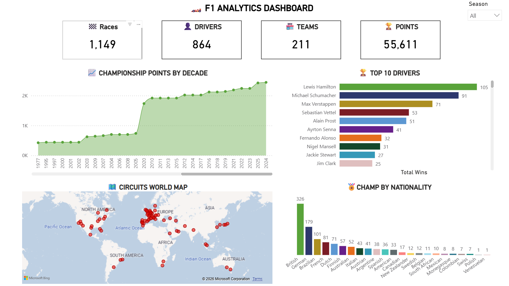

# 🏎️ F1 Data Engineering Project

**A comprehensive end-to-end data engineering project processing Formula 1 racing data using Azure Databricks with Medallion Architecture**

---

## Project Overview

This project demonstrates a **production-ready data engineering pipeline** that:

- **Ingests** raw F1 CSV data from [Open databay](https://www.opendatabay.com/data/dataset/c27b4a97-d2e1-4c24-9093-237be4825085)
- **Transforms** data through Bronze → Silver → Gold layers
- **Visualizes** insights in interactive Power BI dashboards
- **Implements** best practices with Delta Lake & Unity Catalog

## Architecture

### DataBricks Job

## 📊 Power BI Dashboard

### Dashboard Preview

---

