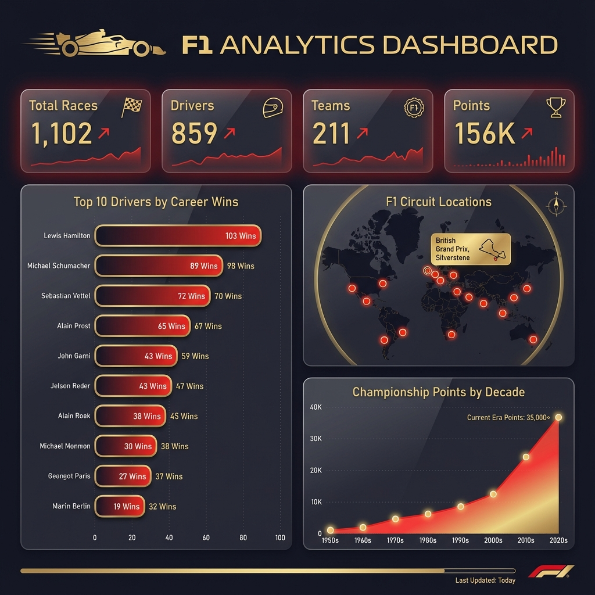
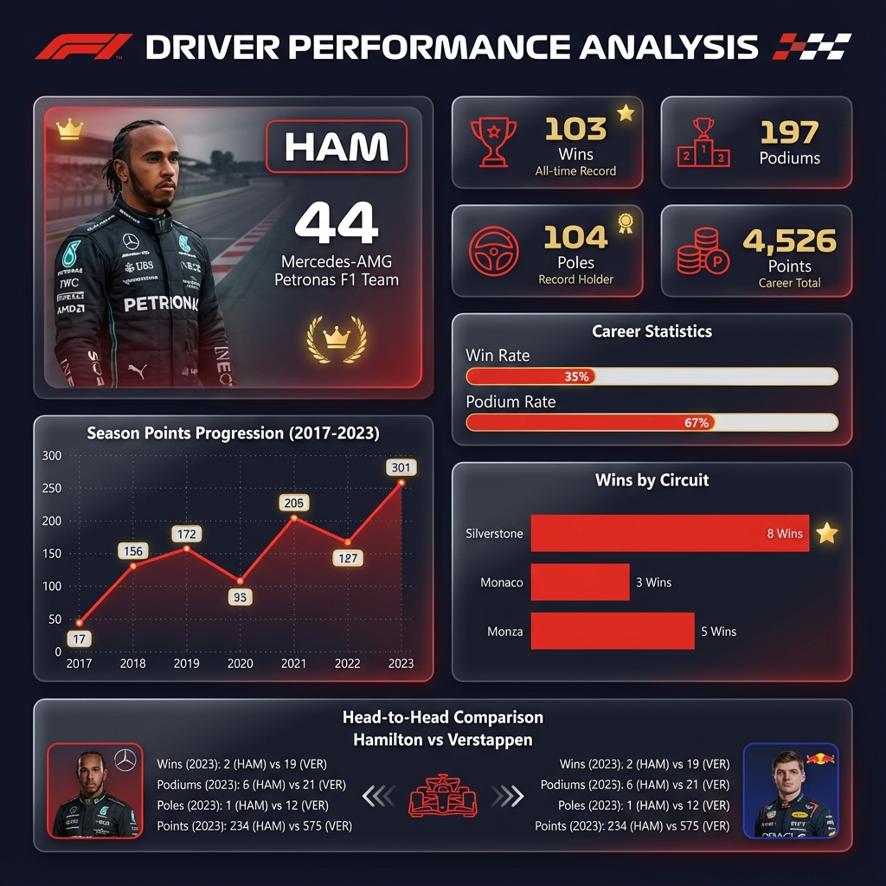
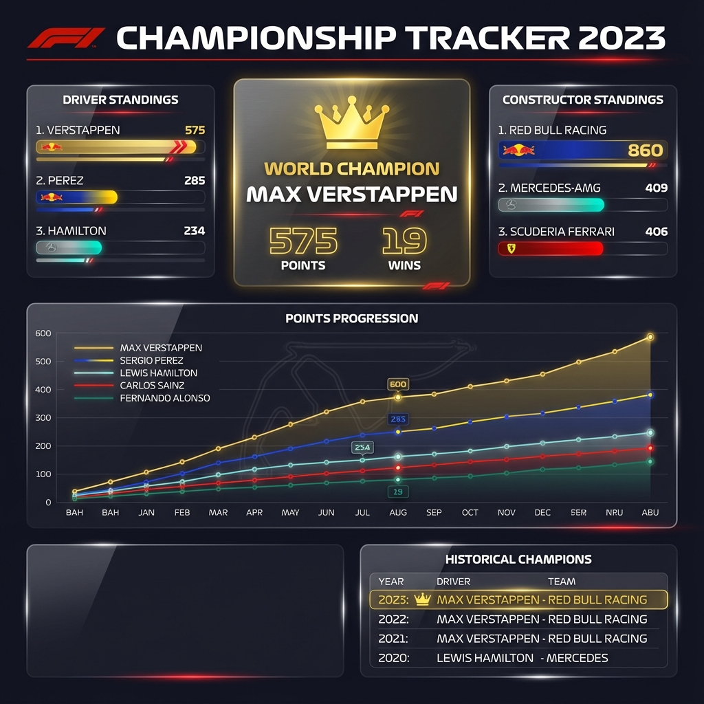

<


**A comprehensive end-to-end data engineering project processing Formula 1 racing data using Azure Databricks with Medallion Architecture**

[Features](#-features) • [Architecture](#-architecture) • [Quick Start](#-quick-start) • [Dashboard](#-power-bi-dashboard) • [Documentation](#-documentation)

</div>

---

## 📊 Project Overview

This project demonstrates a **production-ready data engineering pipeline** that:

- 🔄 **Ingests** raw F1 CSV data from [Ergast API](http://ergast.com/mrd/)
- 🧹 **Transforms** data through Bronze → Silver → Gold layers
- 📊 **Visualizes** insights in interactive Power BI dashboards
- 🏗️ **Implements** best practices with Delta Lake & Unity Catalog

### 📈 Dataset Statistics
| Metric | Value |
|--------|-------|
| **Total Records** | 600,000+ |
| **Historical Span** | 1950 - 2024 |
| **Races Covered** | 1,100+ |
| **Drivers** | 850+ |
| **Constructors** | 210+ |
| **Circuits** | 77 |

---

## ✨ Features

- ✅ **Medallion Architecture** - Bronze, Silver, Gold data layers
- ✅ **Delta Lake** - ACID transactions, time travel, schema evolution
- ✅ **Unity Catalog** - Governance and data discoverability
- ✅ **PySpark** - Distributed data processing
- ✅ **Power BI Integration** - Executive dashboards
- ✅ **Modular Design** - Reusable, maintainable code structure

---

## 🏗️ Architecture

```
┌─────────────────────────────────────────────────────────────────────────────┐
│                          F1 DATA PIPELINE                                    │
├─────────────────────────────────────────────────────────────────────────────┤
│                                                                              │
│   📁 SOURCE          🥉 BRONZE          🥈 SILVER          🥇 GOLD          │
│   ─────────         ──────────         ──────────         ──────────        │
│   CSV Files    ──►  Raw Ingest    ──►  Cleansed     ──►  Analytics          │
│   (14 files)        Delta Tables       Transformed       Aggregated         │
│                                                                              │
│   circuits          circuits           circuits           fact_race_results │
│   constructors      constructors       constructors       dim_driver_career │
│   drivers           drivers            drivers            dim_constructor   │
│   races             races              races              agg_championships │
│   results           results            results            agg_circuits      │
│   qualifying        qualifying         qualifying         agg_performance   │
│   lap_times         lap_times          lap_times                            │
│   pit_stops         pit_stops          pit_stops                ▼           │
│   standings...      standings...       standings...        ┌─────────┐      │
│   ...               ...                ...                 │Power BI │      │
│                                                            │Dashboard│      │
│                                                            └─────────┘      │
│                                                                              │
└─────────────────────────────────────────────────────────────────────────────┘
```

### Data Flow

| Layer | Purpose | Transformations | Tables |
|-------|---------|-----------------|--------|
| **Bronze** | Raw storage | Metadata only | 14 |
| **Silver** | Cleansed data | Type conversion, derived columns | 11 |
| **Gold** | Analytics ready | Aggregations, denormalization | 8 |

---

## 📁 Project Structure

```
F1_Project/
│
├── 📂 my_data/                              # Raw source data (CSV)
│   ├── circuits.csv
│   ├── constructors.csv
│   ├── drivers.csv
│   ├── races.csv
│   ├── results.csv
│   ├── qualifying.csv
│   ├── lap_times.csv
│   ├── pit_stops.csv
│   ├── driver_standings.csv
│   ├── constructor_standings.csv
│   ├── constructor_results.csv
│   ├── seasons.csv
│   ├── status.csv
│   └── sprint_results.csv
│
├── 📂 notebooks/                            # Databricks notebooks
│   ├── 01_bronze_layer_ingestion.py        # Bronze ETL pipeline
│   ├── 02_silver_layer_transformation.py   # Silver ETL pipeline
│   └── 03_gold_layer_aggregations.py       # Gold ETL pipeline
│
├── 📂 docs/                                 # Documentation
│   ├── DATA_MODEL.md                       # Schema documentation
│   ├── POWERBI_INTEGRATION.md              # BI setup guide
│   └── POWERBI_DASHBOARD_DESIGN.md         # Dashboard specifications
│
├── SKILL.md                                 # Skills showcase
└── README.md                                # This file
```

---

## � Quick Start

### Prerequisites

- Azure Databricks Workspace
- Azure Data Lake Storage Gen2 (or DBFS)
- Power BI Desktop

### Step 1: Clone Repository

```bash
git clone https://github.com/yourusername/f1-data-engineering.git
cd f1-data-engineering
```

### Step 2: Upload Data

Upload CSV files to your storage location:

```
/mnt/f1_project/raw/
├── circuits.csv
├── constructors.csv
├── drivers.csv
└── ... (all CSV files)
```

### Step 3: Run Notebooks

Execute in order:

```
1. 01_bronze_layer_ingestion.py    → Creates f1_dev.bronze
2. 02_silver_layer_transformation.py → Creates f1_dev.silver  
3. 03_gold_layer_aggregations.py    → Creates f1_dev.gold
```

### Step 4: Connect Power BI

1. Open Power BI Desktop
2. Get Data → Azure → Azure Databricks
3. Select `f1_dev.gold` tables
4. Build your dashboard!

---

## 📊 Power BI Dashboard

### Dashboard Preview

The F1 Analytics Dashboard provides comprehensive insights across 5 interactive pages:

<div align="center">

#### 🏆 Executive Summary


#### 👤 Driver Performance Analysis


#### 🏆 Championship Tracker


</div>

### Page 1: Executive Summary
- KPIs: Total races, drivers, teams, points
- Top 10 drivers by all-time wins
- World map of F1 circuits
- Points trend by decade

### Page 2: Driver Performance
- Driver spotlight cards
- Career statistics breakdown
- Head-to-head comparisons
- Circuit-specific performance

### Page 3: Constructor Analysis  
- Team win distribution
- Championship history timeline
- Points progression by season
- Driver roster analysis

### Page 4: Race Analytics
- Grid vs finish position scatter
- DNF analysis by cause
- Circuit difficulty metrics
- Race results tables

### Page 5: Championship Tracker
- Live standings visualization
- Points progression chart
- Historical champions list
- Constructor standings

### Design Theme

| Element | Color | Hex |
|---------|-------|-----|
| Primary | F1 Red | `#E10600` |
| Background | Dark Navy | `#15151E` |
| Accent | Gold | `#FFD700` |
| Success | Green | `#00D26A` |
| Surface | Card BG | `#1F1F2E` |

---

## 📋 Data Model

### Gold Layer Schema (Primary Tables)

#### `fact_race_results` - Primary Fact Table
| Column | Type | Description |
|--------|------|-------------|
| result_id | INT | Primary Key |
| race_id, driver_id, constructor_id | INT | Foreign Keys |
| grid_position, finish_position | INT | Race positions |
| points_earned | DOUBLE | Points scored |
| is_winner, is_podium | BOOLEAN | Derived flags |
| race_year, race_name, race_date | - | Race dimensions |
| driver_name, constructor_name | STRING | Denormalized dimensions |
| circuit_name, circuit_country | STRING | Location info |
| status_description, status_category | STRING | DNF analysis |

#### `dim_driver_career` - Driver Lifetime Stats  
| Metric | Description |
|--------|-------------|
| total_wins | Career race wins |
| total_podiums | P1 + P2 + P3 finishes |
| total_pole_positions | Front row starts |
| total_career_points | Lifetime points |
| win_percentage | Win rate |
| debut_year / last_season | Career span |

#### `dim_constructor_performance` - Team Stats
| Metric | Description |
|--------|-------------|
| total_race_entries | All race starts |
| total_wins | Team victories |
| total_drivers | Unique drivers |
| win_rate | Victory percentage |
| seasons_competed | Years active |

For complete schema documentation, see [DATA_MODEL.md](docs/DATA_MODEL.md).

---

## 📈 Sample Insights

### Top 10 All-Time Winners

```sql
SELECT driver_name, total_wins, total_podiums, win_percentage
FROM f1_dev.gold.dim_driver_career
ORDER BY total_wins DESC
LIMIT 10
```

| Driver | Wins | Podiums | Win % |
|--------|------|---------|-------|
| Lewis Hamilton | 103 | 197 | 35.2% |
| Michael Schumacher | 91 | 155 | 29.5% |
| Max Verstappen | 62 | 107 | 37.8% |
| Sebastian Vettel | 53 | 122 | 19.4% |
| Alain Prost | 51 | 106 | 25.6% |

### Championship Winners

```sql
SELECT season, driver_name, championship_points, total_wins
FROM f1_dev.gold.agg_driver_championships
WHERE is_champion = TRUE
ORDER BY season DESC
LIMIT 5
```

---

## 🛠️ Technology Stack

| Category | Technology |
|----------|------------|
| **Cloud Platform** | Microsoft Azure |
| **Compute** | Azure Databricks |
| **Processing** | Apache Spark (PySpark) |
| **Storage Format** | Delta Lake |
| **Governance** | Unity Catalog |
| **Visualization** | Power BI |
| **Language** | Python, SQL |
| **Data Source** | Ergast F1 API (CSV) |

---

## � Documentation

| Document | Description |
|----------|-------------|
| [DATA_MODEL.md](docs/DATA_MODEL.md) | Complete schema reference |
| [POWERBI_INTEGRATION.md](docs/POWERBI_INTEGRATION.md) | BI connection guide |
| [POWERBI_DASHBOARD_DESIGN.md](docs/POWERBI_DASHBOARD_DESIGN.md) | Dashboard specifications |

---

## 🔮 Future Enhancements

- [ ] 🔴 Real-time streaming for live race updates
- [ ] 🤖 ML predictions for race outcomes  
- [ ] 🌧️ Weather data integration
- [ ] 📊 Automated data quality monitoring
- [ ] 🔄 CI/CD pipeline with Azure DevOps
- [ ] 📱 Mobile Power BI app optimization

---

## 🤝 Contributing

Contributions are welcome! Please feel free to submit a Pull Request.

1. Fork the repository
2. Create your feature branch (`git checkout -b feature/AmazingFeature`)
3. Commit your changes (`git commit -m 'Add some AmazingFeature'`)
4. Push to the branch (`git push origin feature/AmazingFeature`)
5. Open a Pull Request

---

## 📝 License

This project is for educational purposes. F1 data sourced from [Ergast Developer API](http://ergast.com/mrd/).

---

## 👤 Author

**Data Engineering Portfolio Project**

Skills: Azure Databricks • PySpark • Delta Lake • ETL • Power BI • SQL

[](https://linkedin.com/in/yourprofile)
[](https://github.com/yourprofile)

---

<div align="center">

### 🏁 Happy Racing Analytics! 🏎️

⭐ Star this repo if you find it useful!

</div>
]]>
